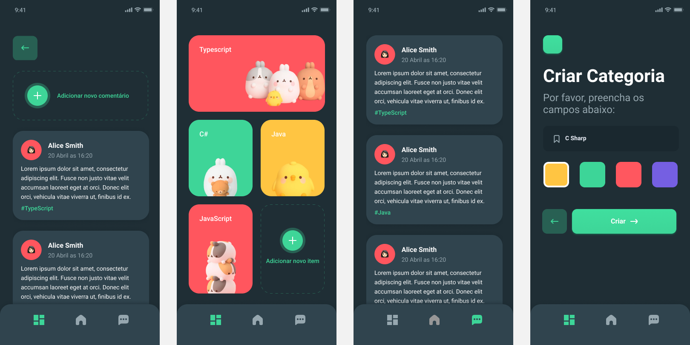

<h1 align="center">
    
</h1>

<h4 align="center">
  Bird App
</h4>

  <a href="#rocket-tecnologias">Tecnologias</a>&nbsp;&nbsp;&nbsp;|&nbsp;&nbsp;&nbsp;
  <a href="#collision-projeto">Projeto</a>&nbsp;&nbsp;&nbsp;|&nbsp;&nbsp;&nbsp;
  <a href="#-layout">Layout</a>&nbsp;&nbsp;&nbsp;|&nbsp;&nbsp;&nbsp;
  <a href="#book-documentação">Documentação</a>&nbsp;&nbsp;&nbsp;|&nbsp;&nbsp;&nbsp;
  <a href="#memo-licença">Licença</a>

## :rocket: Tecnologias

Esse projeto foi desenvolvido com as seguintes tecnologias:

- [Node.js](https://nodejs.org/en/)
- [NestJS](https://nestjs.com/)
- [Ionic](https://ionicframework.com/docs)
- [Angular](https://angular.io/docs)
- [Capacitor](https://capacitorjs.com/docs)

## :collision: Projeto

É um aplicativo para criar categorias e comentários sobre diversos assuntos aleatórios que você goste com outras pessoas.

## 🔖 Layout

O layout foi inspirado no [Marvie](https://www.figma.com/community/file/827876058453173134) e pode ser encontrado [clicando aqui.](https://www.figma.com/file/KcVKBsnGMDucY0llgCqwdt/Bird-App) Lembrando que você irá precisar ter uma conta no [Figma](http://figma.com/).

### Modelo ER

O modelo Entidade e Relacionamento foi criado ao utilizar o [Mermaid.js](https://mermaid-js.github.io/mermaid/) e você pode encontrá-lo [clicando aqui.](./entities.md)

## :memo: Licença

Esse projeto está sob a licença MIT. Veja o arquivo [LICENSE](LICENSE) para mais detalhes.
